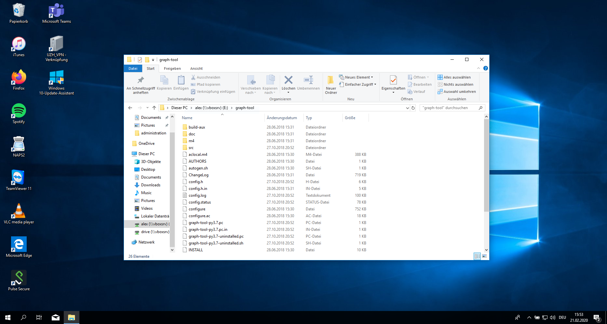
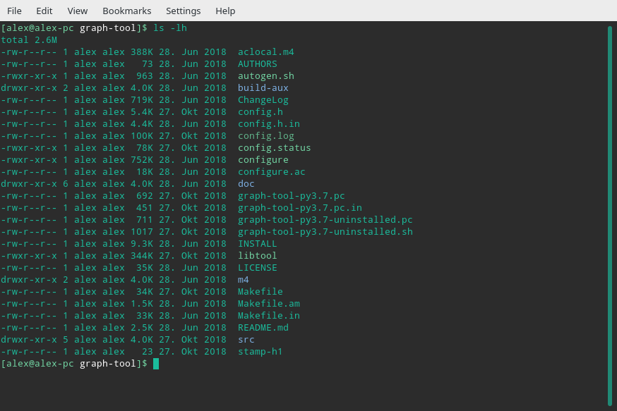

## Outline

- research workflow
- interacting with computers
- installation of programs

::: notes

- Organisatorisches
  - Corona
  - Mail
    - alle erhalten?
    - Mac-User: Installation geklappt?
- Exkurs: wieso braucht es das ganze Tooling?
- Grundverständis für Mensch-Maschine-Interaktion
- Zeitplan für Installation schwierig abzuschätzen

:::

## Recap last Lecture

- textual data is challenging
- machine-readibility 

::: notes

- Bedeutung kontextabhängig
- Unvergleichbarkeit diskreter Symbole
- Abstraktion + Kontextualität kombinieren
- Fragen
  - wichtigste Dateiformate?
    - txt, csv, tsv
  - Sinn von Texteditor?
    - keine Formatierung

:::

# The Zen of Organization

## Empirical Research means Organizing 

- scripts as documentation
- efficient automation
  - "don't repeat yourself"
- less error-prone
- reproducible

::: notes

- Wissenschaft auch praktische Seite, nicht nur theoretische
  - chaotisch statt strukturiert -> Organisation von Komplexität als Problem
  - Wiederverwendung von Code/Datensatz + Literatur/Vorlagen
- Wieso
  - Reproduzierbarkeit höchster Wert
  - je besser Arbeitsablauf -> desto weniger Zeit
- Code strukturiert/dokumentiert Arbeitsablauf
  - gegen Vergessenheit
  - schützt nicht vor Fehler, aber inkrementeller Fortschritt
- wichtig für Projekte + Abschlussarbeiten
- kurzfristig langsamer, langfristig effizienter
  - keine mühsame Fehlersuche, Wiederholung

:::

## Organizing Literature

. . .

:::::::::::::: {.columns}

:::{.column width="50%"}

- manage literature in one place
- generating bibliographies
- collect with a click

:::

:::{.column width="50%"}

](images/zotero.png)

:::

::::::::::::::

::: notes

- Organisation betrifft auch Literatur
- Fragen, wer Literaturverwaltungssystem nutzt
  - was? wieso nützlich?
- Zotero
  - kostenlos, Weiterentwicklung
- Nutzen
  - verschiedene Zitationsstile
  - einmal indexiert, immer gleich
  - Recherche: Metadaten automatisch erhalten
  - Bibliographie automatisch zusammenstellen

:::

# Computers

## Two Trends in Computing

:::::::::::::: {.columns}

:::{.column width="83%"}

- everyday, mobile, cloud-centered, touch/click-based model
  - single-purpose application
  - smartphones
- engineering, open-source, machine-oriented model
  - powerful due to modularity
  - workflow for data science

[see also @Healy2019]

:::

:::{.column width="17%"}

:::

::::::::::::::

::: notes

- Computer haben sich massiv verändert -> am meisten an Oberfläche
- Spannungsfeld zweier Trends
  - Einfachheit --> Eingeschränktheit 
  -  technisches Vorwissen --> Flexibilität
- Apple: GUI/Bedienung Angleichung an physische Welt
- Engineering: schwieriger Einstieg/Lernen, Sinn zu verstehen
  - Programmieren nicht zwingend, nur für Datenstandardisierung
  - keine Zauberei, aber sehr nützlich
- von Wissen/Tools der Engineers profitieren
  - nicht selber bauen
  - geniale Arbeitsabläufe + Modularität

:::

## Operating Systems (OS)

- Microsoft Windows
- macOS
- Linux / Unix :nerd_face:

::: notes

-  OS
  - windows = dominator, Alltag
  - unix = stable, secure, free, innovative. became more userfriendly, sometimes still issue
  - mac = restricted to mac HW, Unix-Derivat, vereint beide Welten
- Betriebssysteme wie Autos, Fahrräder
-  Angleichung über Zeit
   - Installation von Linux in Windows

:::

## User Interfaces

:::::::::::::: {.columns}
::: {.column}

**graphical user interface (GUI)**

{height=7cm}

:::

:::{.column}

**command line interface (CLI)**

{height=7cm}

:::

::::::::::::::

::: notes

- historisch nur CLI zur Computersteuerung
- GUI von Apple entwickelt 1984, in 90er Standard
- CLI ist mehr Sentimentalität
  - mächtiger
  - schneller
  - auf Server einzig mögliche Interaktion

:::

## “An awesome Programmer saves the World” {data-background=https://media.giphy.com/media/AOSwwqVjNZlDO/giphy.gif}

::: notes

- CLI auch in Popkultur, allerdings falsch dargestellt

:::

## Human-Machine Interaction

- text commands instead of clicks
- similar to a human languages
  - syntax (form)
  - semantics (meaning)
- computers are literalists

::: notes

- Automatisierung über GUI nicht möglich
  - statt "hier" klicken, einfach Skript
- viele verschiedene Sprachen
- Syntax sehr restriktiv
  - Computer machen genau, was man ihnen sagt, nichts mehr, nichts weniger. Nie.

:::

## Programming

- command languages
  - Bourne-Again shell (Bash), since 1989
- programming languages
  - Python, R, Java, C++ etc.
- instructions &rarr; program &equiv; algorithm
  - cooking

::: notes

- CLI primär für Dateimanipulation/Verarbeitung
- Python
  - einfach: reduziert auf das elementare
  - Python is a general-purpose language whereas R is a statistical programming language. 
- Algorithmus
  - falsch: "Algo als Böses/Mystisches"
  - korrekt: schrittweise Umwandlung von Input zu Output
  - software = program + data (complement HW)

:::

## Package Manager

- automation of software installation

  - system: apt, Homebrew
  - Python: conda, pip

- software dependencies

- similar to app stores

  

::: notes

- SW baut auf weiterer SW auf
  - keine vollständigen Programme
  - bei Installation hunderte von Kompatibilitäts-Checks
- zentrale Verwaltung lokal/Server-Repo
  - update aller Programme mit einem Befehl
- 2 Manager: systemweit, Python
- app stores keine Innovation
- gehört auch zur Arbeitsorganisation

:::

## The Spirit of Open-Source

> **«Standing on the shoulders of giants.»**

- free + open software
- cross-platform portability
- collaboration 
  - share + reuse
- helpful community

::: notes

- Zusammen erreicht man mehr -> Abhängigkeiten
- Abhängigkeiten funktionieren am besten, wenn offen
  - Rückmeldungen -> gemeinsame Verbesserung
  - enorme Entwicklungsfortschritte
- CS offenste Disziplin
  - Private + Firmen
  - oft unentgeltlich

:::

## Resources

- where you get answers to technical questions
  - [Stack Overflow](https://stackoverflow.com/questions)
- where you find open software
  - [GitHub](https://github.com/)

::: notes

- Kollaboration nicht nur für SW, auch für Fragenbeantwortung
- allermeiste Fragen/Probleme nicht neu, schon beantwortet
  - bash commands auf stackoverflow
  - installationsprobleme
- Github
  - source code + anleitung für Millionen von Programmen (klein und gross)
  - repository

:::

## Remember :thumbsup: {data-background=#4d7e65}

> «Learning by doing, doing by googleing.»

::: notes

- Technical problems are normal + solutions around the corner
  - Fehlermeldung lesen + googlen
- Without the internet, you are a nobody

* Installation is sometimes harder and much more poorly documented than mere usage

:::

# Set up your System

## Backup{data-background=#b5533c}

You don't need it until you desperately need it!

## Installation: Setting up your Development Environment{data-background=#3c70b5}

#### Installation

- Anaconda Platform with Python 3.7
  - packages for NLP + visualization
- Tesseract
- various Bash tools 

Follow the [installation guide](https://aflueckiger.github.io/KED2020/installation_guide.pdf) for your OS.

::: notes

- verschiedene Installationsmöglichkeiten
  - Idee: plattformübergreifend, relativ einfach, uneingeschränkt
  - individuell evtl. Alternativen besser
- Python mit Anaconda
  - wichtigste Packages mitinstalliert
- Windows Leute installieren Ubuntu für Bash
- Installations Guide folgen
  - Verstehen aktuell egal
  - Fragen willkommen
  - Ablauf verfolgen & auf Fehler achten?

:::

## Relax.  It takes a while.{data-background=https://media.giphy.com/media/ZsbqQrUrzRtN6/giphy.gif}

## Spyder IDE

- text editor
  - search/replace, casing
- integrated development environment (IDE)
  - debugging, interactive development
  - similar to RStudio

::: notes

- Teil von Anaconda
- Spyder als Entwicklungscockpit
  - in-class zeigen
- Spyder für Python, andere Texteditoren genereller
- nützliche Textoperationen

:::

## First steps in Python

Learn about Python in the interactive tutorials

- [Python Principles](https://pythonprinciples.com)
- [LearnPython](https://www.learnpython.org/en/Welcome)

::: notes

- Python individuell vertiefen

:::

## Readings 

### optional: pimp your workflow

Healy, Kieran. 2019. “The Plain Person’s Guide to Plain Text Social Science.” [online](https://kieranhealy.org/publications/plain-person-text/).

## References

