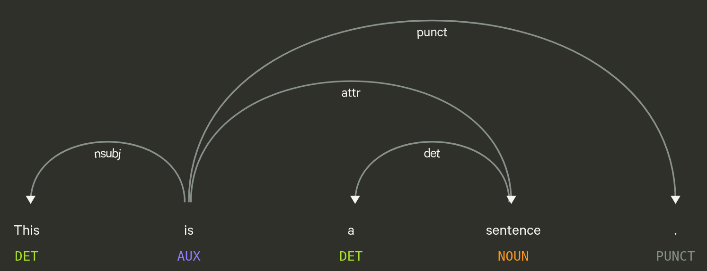

## Recap last Lecture

- introduce Python :snake:
  - editor
  - syntax

::: notes

:::

## Outline

- NLP, getting serious! :innocent:
- interactive coding
  - interrupt, ask, complement
- mini-project

::: notes

- Fragen sehr wichtig, da gewaltiger Sprung zu letzter Session
- Stellschrauben kennen lernen, Gefühl für die Sprache entwickeln
  - Details vorerst unwichtig

:::

<!-- https://towardsdatascience.com/building-a-text-normalizer-using-nltk-ft-pos-tagger-e713e611db8 -->

# Primer on NLP{data-background=images/words.jpg}

## What is a Word?

- word ~ segments between whitespace
- yet, there are ...
  - contractions: `U.S.`, `don't`
  - collocations: `New York`

## Token

:::::::::::::: {.columns}
::: {.column width="50%"}

- token ~ computational unit
  - representation of words
- lemma ~ base form of a word
  - texts &rarr; text
  - goes &rarr; go
- stop words ~ functional words
  - lack meaning
  - the, a, on, and

:::

::: {.column width="50%"}

)](images/tokenization.jpeg)

:::

::::::::::::::

 

Tokenize this: `Let's tokenize! Isn't this easy?` :nerd_face:

::: notes

- Text wird in seine Teile gesplittet
- Lemma ~ Form in Duden

:::

## NLP Processing Steps

{height=5.5cm}

1. tokenizing
   - segmenting text into words, punctuations etc.
2. tagging part-of-speech (POS)
   - assigning word types (e.g. verb, noun)
3. parsing
   - describing syntactic relations

::: notes

- Abfolge von Prozessierungsschritten
- alles sprachabhängig
- Tagging: ca. 20-30 POS tags
- Parsing
  - Verb ist Head von Satz
  - Subjekt-Verb-Objekt

:::

## How does the computer "know"?

- using language specific models
- supervised machine learning
- trained on human-annotated data

::: notes

- die meisten haben ihr Schulwissen wieder vergessen, wieso kann das der Computer
- Intuition einfach, genaue technische Funktionsweise egal
  - Genauigkeit wichtig, aber noch zu advanced
  - best-practice

:::

## Representation of Corpus

#### document term matrix

:::::::::::::: {.columns}
::: {.column width="50%"}

- Doc 1: `NLP is great. I love NLP.`
- Doc 2: `I want to learn more on NLP.`
- Doc 3: `NLP, NLP, NLP.`

:::

::: {.column width="50%"}

|              | `NLP` | `I`  | `is` | *term*           |
| ------------ | ----- | ---- | ---- | ---------------- |
| **Doc 1**    | 2     | 1    | 1    | ...              |
| **Doc 2**    | 1     | 1    | 0    | ...              |
| **Doc 3**    | 3     | 0    | 0    | ...              |
| ***Doc ID*** | ...   | ...  | ...  | *term frequency* |

:::

::::::::::::::

## Mini-Project 

- relative frequency :thumbsup:, absolute frequency :thumbsdown:
- multiple documents
- compare ...
  - historically
  - across actors
- write script 

:::

- noch nicht alle in Liste?
- "Forschungsfrage" überlegen
- script ist gemachte arbeit zur wiederverwendung

:::

## Optional Seminar Paper

- writing a seminar paper (4 ECTS)
- get in touch to discuss your idea

## Outlook NLP

- explore corpus differences by political party
- term frequency over time
- data
  - party programmes
  - 1 August speeches by Federal Councillors

## Do NLP

[Check out the Python code](https://github.com/aflueckiger/KED2020/tree/master/scripts/KED2020_10.ipynb)

## Resources

#### tutorials on spaCy

- [Official spaCy 101](https://spacy.io/usage/spacy-101)

- [Hitchhiker's Guide to NLP in spaCy](https://www.kaggle.com/nirant/hitchhiker-s-guide-to-nlp-in-spacy)